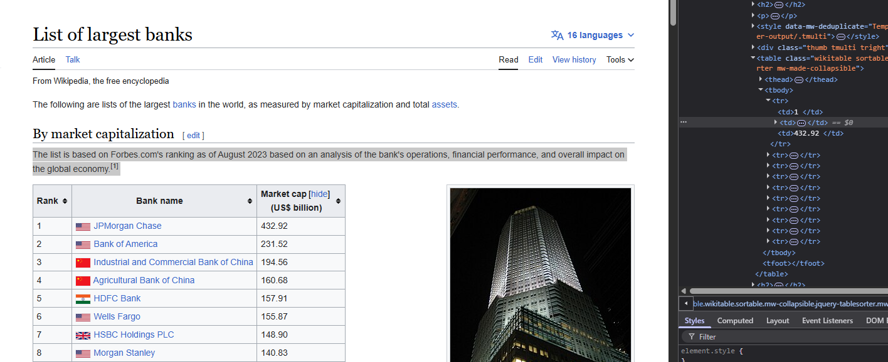
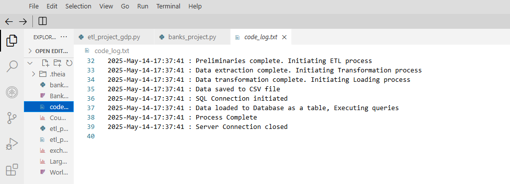
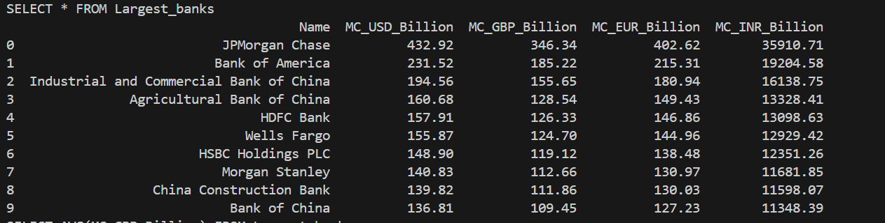
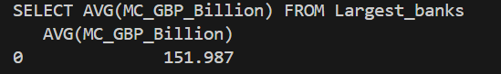
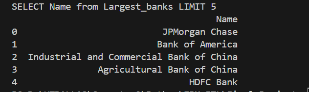

# ETL Pipeline: World's Largest Banks by Market Capitalization

This project demonstrates a complete **ETL (Extract, Transform, Load)** pipeline using Python to compile and process a list of the **top 10 largest banks in the world by market capitalization**. The pipeline is designed for quarterly reuse and includes detailed logging at each step.

---

## Project Overview

- **Source**: Wikipedia (archived version)
- **Output Formats**: CSV file & SQLite database
- **Currency Conversion**: USD → GBP, EUR, INR
- **Automation**: Built-in logging and reusability for quarterly updates

---
## HTML Inspection for Data Extraction

To extract the required data table from Wikipedia, we inspected the archived webpage’s HTML structure. The table under the **"By market capitalization"** section contains the ranking of banks by market cap in USD.

Using browser Developer Tools (`Right Click > Inspect`), we identified:
- The table is contained within a `<table>` tag with classes:  
  `wikitable sortable mw-collapsible`
- Table rows (`<tr>`) contain data cells (`<td>`) for:
  - Rank
  - Bank Name
  - Market Capitalization (USD)

This inspection allowed us to programmatically locate and extract relevant data using **BeautifulSoup** in the `extract()` function.

> 


## ETL Pipeline Stages

### 1. **Extract**
- Extracts a table from [Wikipedia](https://web.archive.org/web/20230908091635/https://en.wikipedia.org/wiki/List_of_largest_banks) listing the top 10 banks by market cap.
- Extracted columns: `Name`, `MC_USD_Billion`

### 2. **Transform**
- Reads exchange rates from `exchange_rate.csv`
- Converts `MC_USD_Billion` into:
  - `MC_GBP_Billion`
  - `MC_EUR_Billion`
  - `MC_INR_Billion`
- Values are rounded to 2 decimal places

### 3. **Load**
- Saves the transformed DataFrame to:
  - A CSV file: `Largest_banks_data.csv`
  - A SQLite database: `Banks.db`, table `Largest_banks`
 
## Logged Stages (`code_log.txt`)
Sample log entries include:
>

---


## Sample Queries Run
- View all data:  
  `SELECT * FROM Largest_banks`
  
  >
- Get average market cap in GBP:  
  `SELECT AVG(MC_GBP_Billion) FROM Largest_banks`
  
  >
- List top 5 bank names:  
  `SELECT Name FROM Largest_banks LIMIT 5`
  
  >

---

## How to Run

1. **Install Requirements**  
   All required packages are from the Python standard library or widely available:
   ```bash
   pip install pandas beautifulsoup4

2. **Run the ETL Script**  
   Execute the Python script:
   ```bash
   python etl_project_banks.py
---
## Conclusion

This project successfully demonstrates a real-world ETL pipeline using Python to extract, transform, and load financial data from a public web source. The pipeline converts market capitalization figures into multiple currencies, stores the results in both CSV and SQLite formats, and logs progress for transparency and debugging.

The modular design allows this solution to be reused each financial quarter by simply updating the exchange rate file. With built-in logging and database integration, this ETL pipeline is a reliable and extensible tool for financial data analysis and reporting.


